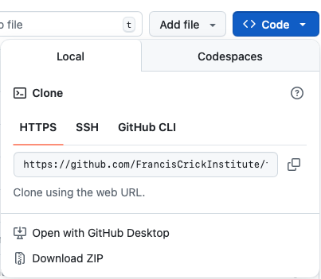

# From notebook to pipeline
Work in progress for a new intermediate image analysis training workshop

## Repo content
* The `Data` folder contains images of cells which have been stained for *nuclei (Hoescht, ch0)*, *tubulin (AlexaFluor568, ch1)*, *actin (AlexaFluor488, ch2)*, and *YAP/TAZ (AlexaFluor647, ch3)* and imaged with fluorescent microscopy. You can find more information about this [public image dataset](https://idr.openmicroscopy.org/webclient/?show=plate-5679) in [the associated publication](https://www.nature.com/articles/sdata201718).
* The `Scripts` folder contains two notebooks to perform an image analysis pipeline on a single image, or on all images in the `Data` folder, respectively. The pipeline consists in a segmentation task, followed by morphological and intensity quantifications per object.

## Local setup
A step-by-step guide to downloading the repo and running the notebooks is presented below. **You only need to perform Steps 1-3 once.** Every subsequent time you want to run the code, skip straight to step 4.
### Step 1 - download the content of the repo

#### Easy way - Follow these steps if you are not familiar with Git

Click on the small arrow on the `<> Code` button above and then click `Download Zip`:


 
When the download completes, unzip the contents. You should now have a folder that looks like this:


Below, we will use the requirements file to set up a Python environment to run the Jupyter notebooks contained in the `Scripts` folder.

#### Harder way

If you are already familiar with Git, you can obviously clone this repo like any other. 

### Step 2 - install a Python distribution

We recommend using conda as it's relatively straightforward and makes the management of different Python environments simple. You can install conda from [here](https://www.anaconda.com/docs/getting-started/miniconda/install) (miniconda will suffice).

### Step 3 - create a Python environment

Once conda is installed, open Anaconda Prompt and run the following series of commands:

```
conda create --name notebook-pipeline-env pip
conda activate notebook-pipeline-env
python -m pip install -r <path to this repo>/requirements.txt
```
where you need to replace `<path to this repo>` with the location on your file system where you downloaded this repo. You will be presented with a list of packages to be downloaded and installed. The following prompt will appear:
```
Proceed ([y]/n)?
```
Hit Enter and all necessary packages will be downloaded and installed - this may take some time. When complete, you can deactivate the environment you have created with the following command.

```
conda deactivate
```
You have successfully set up the necessary conda environment!

### Step 4 - activate the Python environment and launch Jupyter Lab

The following commands will activate the environment and start Jupyter Lab in the repository folder:
```
conda activate notebook-pipeline-env
cd <path to this repo>
jupyter-lab
```

Jupyter Lab should open in your browser - follow the step-by-step instructions in the notebook to run the code. If you are not familiar with Jupyter Notebooks, you can find a detailed introduction [here](https://jupyter-notebook.readthedocs.io/en/latest/notebook.html#introduction).

